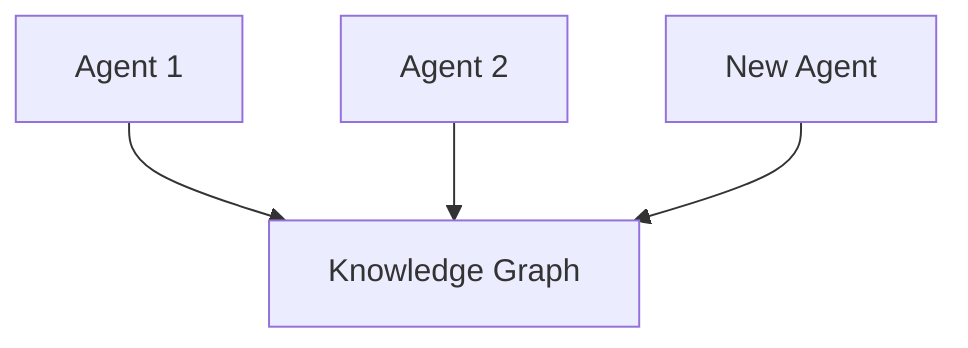
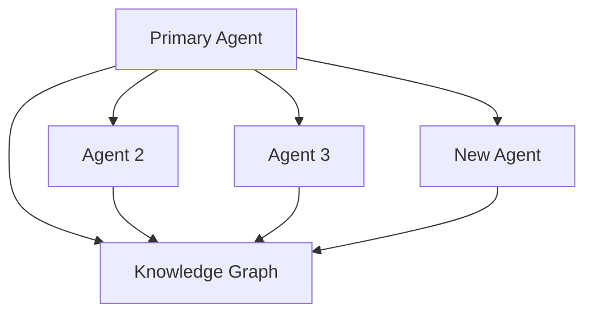
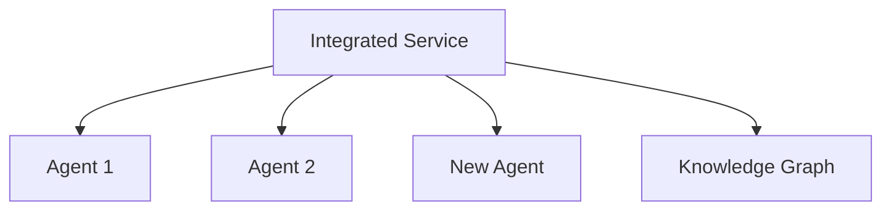
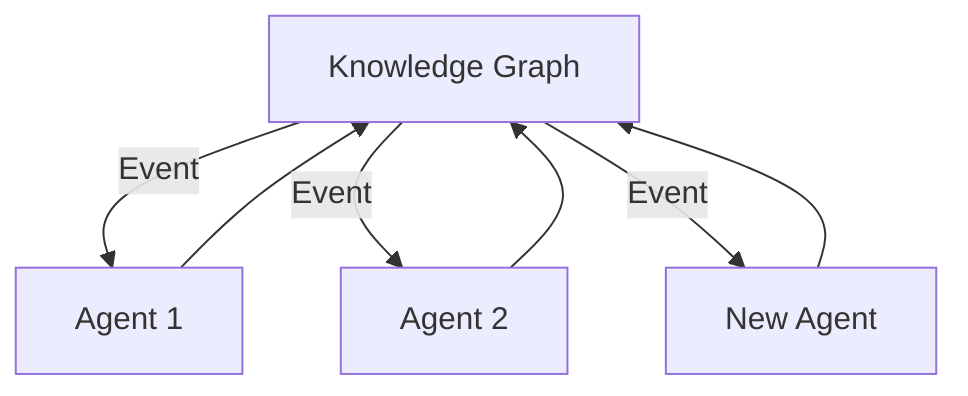

# Extending the Agentic Architecture

This document provides guidance on extending the DevLoop agentic architecture with new agents and capabilities. The current architecture integrates the Feature Creation Agent and Task Agent, but is designed to be expanded with additional specialized agents.

## Table of Contents

- [Overview](#overview)
- [Agent Integration Patterns](#agent-integration-patterns)
- [Adding a New Agent](#adding-a-new-agent)
- [Agent Communication](#agent-communication)
- [UI Integration](#ui-integration)
- [Recommended Agent Extensions](#recommended-agent-extensions)

## Overview

The DevLoop agentic architecture is built around specialized AI agents that handle specific aspects of the software development process. Each agent has a focused role, well-defined responsibilities, and clear interfaces for integration with other system components.

Current agents:
- **Feature Creation Agent** - Analyzes and organizes features
- **Task Agent** - Generates and manages tasks

The architecture is designed for seamless extension with additional agents that can enhance various aspects of the software development lifecycle.

## Agent Integration Patterns

The system uses several integration patterns that new agents should follow:

### 1. Direct Agent Integration

This pattern involves adding a new agent that operates independently but shares data with other agents through the Knowledge Graph.



### 2. Agent Orchestration

This pattern involves agents communicating directly with each other, with one agent orchestrating a workflow.



### 3. Service-Integrated Agents

This pattern combines multiple agents through an integrated service layer, like the FeatureAgentService.



### 4. Event-Driven Agents

This pattern involves agents responding to events and notifications from the system.



## Adding a New Agent

Follow these steps to add a new agent to the architecture:

### 1. Define Agent Purpose and Responsibilities

Clearly define what the agent will do, ensuring it has a focused purpose and doesn't overlap excessively with existing agents. Document:
- Primary responsibilities
- Input data requirements
- Output data format
- Integration points with other agents
- Expected performance characteristics

### 2. Create Agent Implementation

Create a Python module for the agent following the established pattern:

```python
class NewAgent:
    """
    [Agent description]
    """
    
    def __init__(self):
        self.agent_id = "agent-new-agent"
        self.agent_name = "New Agent"
        self.version = "1.0.0"
        
        # Initialize tools and services
        
    def process_request(self, request):
        """
        Process a request with this agent
        
        Args:
            request: Dictionary containing request data
            
        Returns:
            Dictionary containing response data
        """
        # Implementation
        
    # Additional methods as needed
```

### 3. Create API Endpoints

Add API endpoints for the new agent in the appropriate routes file:

```javascript
router.post('/new-agent/process', async (req, res) => {
  try {
    // Extract request data
    const requestData = req.body;
    
    // Execute the agent
    const process = spawn('python3', [
      NEW_AGENT_SCRIPT,
      '--operation', 'process_request',
      `--params=${paramsPath}`
    ]);
    
    // Handle response
    // ...
    
    res.status(200).json(result);
  } catch (error) {
    res.status(500).json({
      success: false,
      error: `Error processing request: ${error.message}`
    });
  }
});
```

### 4. Create UI Service

Create a service in the UI layer to interact with the new agent:

```javascript
/**
 * New Agent Service
 * 
 * Provides methods for interacting with the New Agent API.
 */

const API_BASE_URL = 'http://localhost:8000/api';
const NEW_AGENT_ENDPOINT = `${API_BASE_URL}/new-agent`;

/**
 * Process a request with the New Agent
 * @param {Object} requestData - The request data
 * @returns {Promise<Object>} The processed data
 */
export const processWithNewAgent = async (requestData) => {
  try {
    const response = await fetch(`${NEW_AGENT_ENDPOINT}/process`, {
      method: 'POST',
      headers: {
        'Content-Type': 'application/json',
      },
      body: JSON.stringify(requestData),
    });
    
    if (!response.ok) {
      throw new Error(`Error processing request: ${response.statusText}`);
    }
    
    return await response.json();
  } catch (error) {
    console.error('Error in processWithNewAgent:', error);
    throw error;
  }
};
```

### 5. Create Integration Service (if needed)

If the new agent works directly with existing agents, create an integration service:

```javascript
/**
 * Combined Agent Service
 * 
 * Provides methods for using multiple agents together in an integrated workflow.
 */
import { processWithExistingAgent } from './existingAgentService';
import { processWithNewAgent } from './newAgentService';

/**
 * Process data with multiple agents in sequence
 * @param {Object} requestData - The initial request data
 * @returns {Promise<Object>} The final processed data
 */
export const processWithCombinedAgents = async (requestData) => {
  try {
    // Step 1: Process with existing agent
    const existingResult = await processWithExistingAgent(requestData);
    
    if (!existingResult.success) {
      return existingResult;
    }
    
    // Step 2: Process with new agent
    const combinedData = {
      ...requestData,
      existingResult: existingResult.data
    };
    
    const newResult = await processWithNewAgent(combinedData);
    
    // Return combined results
    return {
      success: newResult.success,
      message: `Multi-agent processing ${newResult.success ? 'succeeded' : 'failed'}`,
      existingData: existingResult.data,
      newData: newResult.data
    };
  } catch (error) {
    console.error('Error in processWithCombinedAgents:', error);
    throw error;
  }
};
```

### 6. Integrate with UI Components

Update existing UI components or create new ones to interact with the new agent:

```jsx
import { processWithNewAgent } from '../services/newAgentService';

const NewAgentComponent = () => {
  const [data, setData] = useState(null);
  const [loading, setLoading] = useState(false);
  const [error, setError] = useState(null);
  
  const handleProcess = async () => {
    setLoading(true);
    setError(null);
    
    try {
      const result = await processWithNewAgent({ /* data */ });
      setData(result);
    } catch (err) {
      setError(err.message);
    } finally {
      setLoading(false);
    }
  };
  
  // Render component
};
```

### 7. Update Knowledge Graph Integration

Ensure the new agent can read from and write to the Knowledge Graph:

```python
def get_knowledge_graph_data(self, query):
    """Get data from the Knowledge Graph"""
    # Implementation
    
def update_knowledge_graph(self, data):
    """Update the Knowledge Graph with new data"""
    # Implementation
```

### 8. Add Agent Communication

Implement communication methods if the agent needs to interact with other agents:

```python
def send_message_to_agent(self, agent_id, message):
    """Send a message to another agent"""
    # Implementation
    
def handle_agent_message(self, message):
    """Handle a message from another agent"""
    # Implementation
```

## Agent Communication

Agents can communicate with each other in several ways:

### 1. Knowledge Graph as Communication Channel

Agents can share data by writing to and reading from the Knowledge Graph. This is the primary method of asynchronous communication.

### 2. Direct Agent Messages

For real-time coordination, agents can send messages directly to each other:

```python
# Agent 1 sends a message
self.communication_service.send_message(
    sender="agent-1",
    recipient="agent-2",
    message_type="request",
    content={
        "action": "process_data",
        "data": {...}
    }
)

# Agent 2 receives and processes the message
def handle_message(self, message):
    if message.message_type == "request" and message.content.get("action") == "process_data":
        # Process the request
        result = self.process_data(message.content.get("data"))
        
        # Send a response
        self.communication_service.send_message(
            sender="agent-2",
            recipient=message.sender,
            message_type="response",
            content={
                "action": "process_data_result",
                "result": result
            }
        )
```

### 3. Event-Based Communication

Agents can subscribe to events in the system and respond accordingly:

```python
# Agent subscribes to events
self.event_service.subscribe("feature_created", self.handle_feature_created)
self.event_service.subscribe("task_completed", self.handle_task_completed)

# Event handlers
def handle_feature_created(self, event):
    feature_id = event.data.get("feature_id")
    # Process the new feature
    
def handle_task_completed(self, event):
    task_id = event.data.get("task_id")
    feature_id = event.data.get("feature_id")
    # Check if all tasks for the feature are complete
```

## UI Integration

When integrating new agents into the UI, follow these patterns:

### 1. Service Layer

Always create a service layer between UI components and agent APIs:

```javascript
// newAgentService.js
export const processWithNewAgent = async (data) => {
  // Implementation
};

// Component.jsx
import { processWithNewAgent } from '../services/newAgentService';

// Use the service in the component
const result = await processWithNewAgent(data);
```

### 2. Loading and Error States

Always handle loading states and errors:

```jsx
const [loading, setLoading] = useState(false);
const [error, setError] = useState(null);

const handleAction = async () => {
  setLoading(true);
  setError(null);
  
  try {
    const result = await processWithNewAgent(data);
    // Handle success
  } catch (err) {
    setError(err.message);
  } finally {
    setLoading(false);
  }
};

// In the render method
{loading && <LoadingIndicator />}
{error && <ErrorMessage error={error} />}
```

### 3. Fallback Mechanisms

Always implement fallbacks in case the agent is unavailable:

```javascript
export const processWithNewAgent = async (data) => {
  try {
    // Try to use the agent
    const response = await fetch(`${NEW_AGENT_ENDPOINT}/process`, {
      method: 'POST',
      headers: { 'Content-Type': 'application/json' },
      body: JSON.stringify(data)
    });
    
    if (!response.ok) {
      throw new Error(`Error: ${response.statusText}`);
    }
    
    return await response.json();
  } catch (error) {
    console.warn('New Agent unavailable, using fallback:', error);
    
    // Fallback implementation
    return fallbackProcessing(data);
  }
};
```

## Recommended Agent Extensions

Here are some recommended agents to extend the system:

### 1. Documentation Agent

Purpose: Generate and maintain documentation for features and tasks

Responsibilities:
- Generate documentation from feature descriptions
- Update documentation when features change
- Generate API documentation
- Generate user guides
- Check documentation quality and coverage

### 2. Testing Agent

Purpose: Generate test plans and test cases for features

Responsibilities:
- Analyze feature requirements to identify test scenarios
- Generate unit test skeletons
- Generate integration test plans
- Identify edge cases and boundary conditions
- Track test coverage for features

### 3. Code Review Agent

Purpose: Assist with code reviews for implemented features

Responsibilities:
- Analyze code changes for potential issues
- Check for adherence to best practices
- Identify performance concerns
- Suggest improvements and optimizations
- Verify that implementation matches requirements

### 4. Dependency Management Agent

Purpose: Manage dependencies between features and components

Responsibilities:
- Identify potential dependencies between features
- Track feature dependencies
- Notify developers of dependency changes
- Suggest optimal implementation order
- Detect circular dependencies

### 5. Planning Agent

Purpose: Assist with project planning and resource allocation

Responsibilities:
- Analyze feature complexity and effort requirements
- Suggest optimal milestone organization
- Predict implementation timelines
- Identify resource bottlenecks
- Optimize development schedules

---

By following these guidelines, you can extend the DevLoop agentic architecture with new agents that integrate seamlessly with the existing system, enhancing its capabilities while maintaining a cohesive architecture.