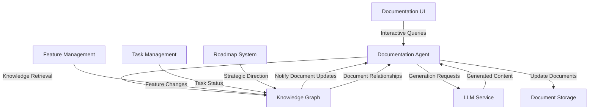

# Agentic Document System Architecture

This document outlines the architecture for an agent-based document generation and management system that integrates with the larger DevLoop roadmap and feature system.

## Core Concepts

The agentic document system is built on these foundational concepts:

1. **Documents as Living Entities**: Documents are not static files but dynamic, connected entities that evolve with the system
2. **LLM-Powered Agent Interaction**: Real-time document creation and enhancement through LLM agents
3. **Knowledge Graph Integration**: All documents and sections exist as nodes in the knowledge graph
4. **Bidirectional Connections**: Changes in features affect documentation and vice versa
5. **Interactive Exploration**: Conversational interface for exploring and manipulating documentation

## System Architecture



## Agent Capabilities

The Documentation Agent provides these capabilities:

1. **Document Generation**: Create comprehensive documentation based on system knowledge
2. **Content Enhancement**: Suggest improvements to existing documentation
3. **Knowledge Extraction**: Extract structured knowledge from unstructured text
4. **Connection Discovery**: Identify relationships between documents and features
5. **Gap Analysis**: Identify missing documentation for existing features
6. **Interactive Assistance**: Answer questions about documentation and suggest updates

## Knowledge Graph Integration

The document system is deeply integrated with the knowledge graph:

1. **Document Nodes**: Each document is a node with metadata and content
2. **Section Nodes**: Document sections are child nodes with their own relationships
3. **Feature Connections**: Documents connect to feature nodes they describe
4. **Version Tracking**: Document history is preserved in the graph
5. **Relationship Types**:
   - `documents` - Document describes a feature
   - `implements` - Feature implements a document specification
   - `depends_on` - Document depends on another document
   - `extends` - Document extends another document

## LLM Integration

The LLM integration follows these principles:

1. **Contextual Requests**: All LLM requests include relevant knowledge graph context
2. **Targeted Prompting**: Specific templates for different document types and purposes
3. **Human-in-the-Loop**: Suggestions that need human review before committing
4. **Streaming Updates**: Real-time document generation with incremental updates
5. **Multi-step Generation**: Complex documents created through sequential agent actions

## Roadmap Integration

The document system connects to the roadmap through:

1. **Project Milestones**: Documentation requirements for each milestone
2. **Feature Documentation**: Automatic documentation generation for features
3. **Implementation Status**: Documentation reflects current implementation state
4. **Future Planning**: Documentation can describe planned but unimplemented features
5. **Change Impact**: Analyze how roadmap changes affect documentation needs

## User Interaction Flow

1. **Document Discovery**: Users browse or search for documentation
2. **Interactive Queries**: Users ask questions about documents or features
3. **Document Creation**: Users initiate document creation with high-level description
4. **Collaborative Editing**: Agent suggests content which users can accept, modify, or reject
5. **Relationship Management**: Users can view and modify connections between documents

## Implementation Components

### 1. Documentation Agent Service

```javascript
// agent-documentation-service.js
class DocumentationAgent {
  constructor(llmService, knowledgeGraph, documentStore) {
    this.llm = llmService;
    this.kg = knowledgeGraph;
    this.store = documentStore;
    this.chatHistory = new Map(); // Conversation state for each user
  }
  
  async processMessage(userId, message) {
    // Retrieve conversation history
    let history = this.chatHistory.get(userId) || [];
    
    // Get relevant context from knowledge graph
    const context = await this.kg.getRelevantContext(message, history);
    
    // Prepare prompt with context
    const prompt = this.buildPrompt(message, history, context);
    
    // Get LLM response
    const response = await this.llm.complete(prompt);
    
    // Parse agent actions from response
    const actions = this.parseAgentActions(response);
    
    // Execute actions (query KG, update docs, etc)
    const results = await this.executeActions(actions);
    
    // Update conversation history
    history.push({ role: 'user', content: message });
    history.push({ role: 'assistant', content: response, actions, results });
    this.chatHistory.set(userId, history);
    
    return { response, actions, results };
  }
  
  // Other methods for document operations
  async createDocument(spec) {/* ... */}
  async updateDocument(id, changes) {/* ... */}
  async analyzeDocument(id) {/* ... */}
  async findRelatedDocuments(id) {/* ... */}
}
```

### 2. Knowledge Graph Connector

```javascript
// knowledge-graph-connector.js
class KnowledgeGraphConnector {
  constructor(graphDbUrl) {
    this.dbUrl = graphDbUrl;
  }
  
  async getRelevantContext(query, history) {
    // Extract key terms from query and history
    const terms = this.extractKeyTerms(query, history);
    
    // Query knowledge graph for relevant nodes
    const nodes = await this.queryGraph(terms);
    
    // Format nodes into context blocks
    return this.formatContextBlocks(nodes);
  }
  
  async createDocumentNode(document) {
    // Create document node in graph
    const docNode = await this.createNode('document', {
      title: document.title,
      path: document.path,
      createdAt: new Date().toISOString()
    });
    
    // Create section nodes
    const sections = this.extractSections(document.content);
    for (const section of sections) {
      const sectionNode = await this.createNode('section', {
        title: section.title,
        content: section.content
      });
      
      // Connect section to document
      await this.createEdge(docNode.id, sectionNode.id, 'has_section');
    }
    
    // Connect document to related features
    if (document.relatedFeatures) {
      for (const featureId of document.relatedFeatures) {
        await this.createEdge(docNode.id, featureId, 'documents');
      }
    }
    
    return docNode;
  }
  
  // Other graph operations
  async queryGraph(terms) {/* ... */}
  async createNode(type, properties) {/* ... */}
  async createEdge(fromId, toId, relationship) {/* ... */}
  async updateNode(id, properties) {/* ... */}
}
```

### 3. Interactive Documentation UI

```jsx
// DocumentationInterface.jsx
function DocumentationInterface() {
  const [documents, setDocuments] = useState([]);
  const [activeDocument, setActiveDocument] = useState(null);
  const [chatMessages, setChatMessages] = useState([]);
  const [inputMessage, setInputMessage] = useState('');
  
  // Fetch documents on mount
  useEffect(() => {
    async function loadDocuments() {
      const docs = await documentService.getAllDocuments();
      setDocuments(docs);
    }
    loadDocuments();
  }, []);
  
  // Handle sending message to documentation agent
  async function handleSendMessage() {
    // Add user message to chat
    const userMessage = { role: 'user', content: inputMessage };
    setChatMessages(prev => [...prev, userMessage]);
    setInputMessage('');
    
    try {
      // Send message to agent
      const response = await documentService.sendAgentMessage(inputMessage, activeDocument?.id);
      
      // Add agent response to chat
      setChatMessages(prev => [...prev, { 
        role: 'assistant', 
        content: response.response,
        actions: response.actions,
        results: response.results
      }]);
      
      // If document was updated, refresh it
      if (response.actions.some(a => a.type === 'update_document' && a.params.id === activeDocument?.id)) {
        const updatedDoc = await documentService.getDocument(activeDocument.id);
        setActiveDocument(updatedDoc);
      }
      
      // If new document was created, refresh document list
      if (response.actions.some(a => a.type === 'create_document')) {
        const docs = await documentService.getAllDocuments();
        setDocuments(docs);
      }
    } catch (error) {
      console.error('Error communicating with agent:', error);
      // Add error message to chat
      setChatMessages(prev => [...prev, { 
        role: 'system', 
        content: `Error: ${error.message}`
      }]);
    }
  }
  
  return (
    <div className="documentation-interface">
      <div className="document-sidebar">
        <h2>Documents</h2>
        <ul>
          {documents.map(doc => (
            <li 
              key={doc.id} 
              className={doc.id === activeDocument?.id ? 'active' : ''}
              onClick={() => setActiveDocument(doc)}
            >
              {doc.title}
            </li>
          ))}
        </ul>
        <button onClick={() => setChatMessages([{ 
          role: 'assistant', 
          content: 'How can I help you create a new document?' 
        }])}>
          Create New Document
        </button>
      </div>
      
      <div className="document-main">
        {activeDocument ? (
          <div className="document-viewer">
            <h1>{activeDocument.title}</h1>
            <div className="document-content">
              {/* Render document content */}
            </div>
            <div className="document-connections">
              <h3>Related Features</h3>
              {/* Render connected features */}
            </div>
          </div>
        ) : (
          <div className="document-placeholder">
            Select a document or create a new one to get started.
          </div>
        )}
      </div>
      
      <div className="agent-chat">
        <div className="chat-messages">
          {chatMessages.map((msg, index) => (
            <div key={index} className={`message ${msg.role}`}>
              {msg.content}
              {msg.actions && (
                <div className="actions">
                  {/* Render agent actions */}
                </div>
              )}
            </div>
          ))}
        </div>
        
        <div className="chat-input">
          <input
            value={inputMessage}
            onChange={e => setInputMessage(e.target.value)}
            onKeyPress={e => e.key === 'Enter' && handleSendMessage()}
            placeholder="Ask about documentation or request changes..."
          />
          <button onClick={handleSendMessage}>Send</button>
        </div>
      </div>
    </div>
  );
}
```

## Roadmap Integration Components

### 1. Feature-Document Connector

```javascript
// feature-document-connector.js
class FeatureDocumentConnector {
  constructor(knowledgeGraph, documentAgent) {
    this.kg = knowledgeGraph;
    this.agent = documentAgent;
  }
  
  async connectFeatureToDocuments(featureId) {
    // Get feature details
    const feature = await this.kg.getNodeById(featureId);
    
    // Find relevant existing documents
    const relatedDocs = await this.kg.findRelatedDocuments(feature);
    
    // Connect feature to existing documents
    for (const doc of relatedDocs) {
      await this.kg.createEdge(doc.id, featureId, 'documents');
    }
    
    // Check if feature needs new documentation
    const docGaps = await this.agent.analyzeDocumentationGaps(feature, relatedDocs);
    
    // Generate missing documentation
    for (const gap of docGaps) {
      const docSpec = {
        title: gap.suggestedTitle,
        description: gap.description,
        type: gap.documentType,
        relatedFeatures: [featureId]
      };
      
      // Create new document
      const newDoc = await this.agent.createDocument(docSpec);
      
      // Connect new document to feature
      await this.kg.createEdge(newDoc.id, featureId, 'documents');
    }
    
    return {
      feature,
      existingDocuments: relatedDocs,
      newDocuments: docGaps.length > 0
    };
  }
  
  async updateDocumentsForFeatureChange(featureId, changes) {
    // Get connected documents
    const documents = await this.kg.getConnectedNodes(featureId, 'documents', 'incoming');
    
    // Analyze impact of changes on each document
    const impacts = await Promise.all(documents.map(async (doc) => {
      const impact = await this.agent.analyzeChangeImpact(doc, changes);
      return { document: doc, impact };
    }));
    
    // Update documents based on impact analysis
    for (const { document, impact } of impacts) {
      if (impact.needsUpdate) {
        await this.agent.updateDocumentForChanges(document.id, changes, impact);
      }
    }
    
    return impacts;
  }
}
```

### 2. Document-Task Synchronizer

```javascript
// document-task-synchronizer.js
class DocumentTaskSynchronizer {
  constructor(knowledgeGraph, taskAgent, documentAgent) {
    this.kg = knowledgeGraph;
    this.taskAgent = taskAgent;
    this.documentAgent = documentAgent;
  }
  
  async generateTasksFromDocumentation(documentId) {
    // Get document details
    const document = await this.kg.getNodeById(documentId);
    
    // Extract requirements from document
    const requirements = await this.documentAgent.extractRequirements(document);
    
    // Generate tasks for each requirement
    const tasks = [];
    for (const req of requirements) {
      const task = await this.taskAgent.createTaskFromRequirement(req);
      tasks.push(task);
      
      // Connect task to document
      await this.kg.createEdge(task.id, documentId, 'implements');
    }
    
    return tasks;
  }
  
  async updateDocumentForTaskChanges(taskId) {
    // Get task details
    const task = await this.kg.getNodeById(taskId);
    
    // Find connected documents
    const documents = await this.kg.getConnectedNodes(taskId, 'implements', 'incoming');
    
    // Update each document to reflect task status
    for (const doc of documents) {
      await this.documentAgent.updateImplementationStatus(doc.id, task);
    }
  }
}
```

## Unified Roadmap Visualization

The unified roadmap system allows visualization of:

1. **Timeline-based View**: Documents, features, and tasks on a timeline
2. **Relationship View**: Network graph of connections between entities
3. **Status View**: Implementation status across all connected components
4. **Gap Analysis**: Missing documentation or implementation

## Implementation Plan

1. **Phase 1: Knowledge Graph Foundation**
   - Implement document nodes and relationships
   - Connect to existing feature and task nodes
   - Develop basic query capabilities

2. **Phase 2: Document Agent Core**
   - Implement LLM integration 
   - Build basic document generation
   - Create document analysis capabilities

3. **Phase 3: UI Integration**
   - Develop interactive documentation interface
   - Implement chat-based document interaction
   - Create document visualization components

4. **Phase 4: Roadmap Integration**
   - Connect documentation to feature system
   - Implement bidirectional updates
   - Create unified visualization views

5. **Phase 5: Advanced Features**
   - Implement gap analysis
   - Add automated documentation updates
   - Create multi-document knowledge extraction