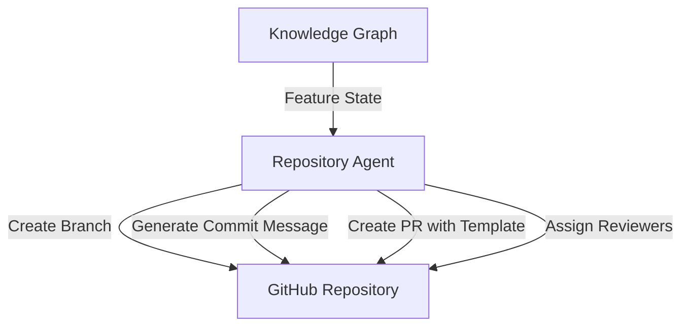
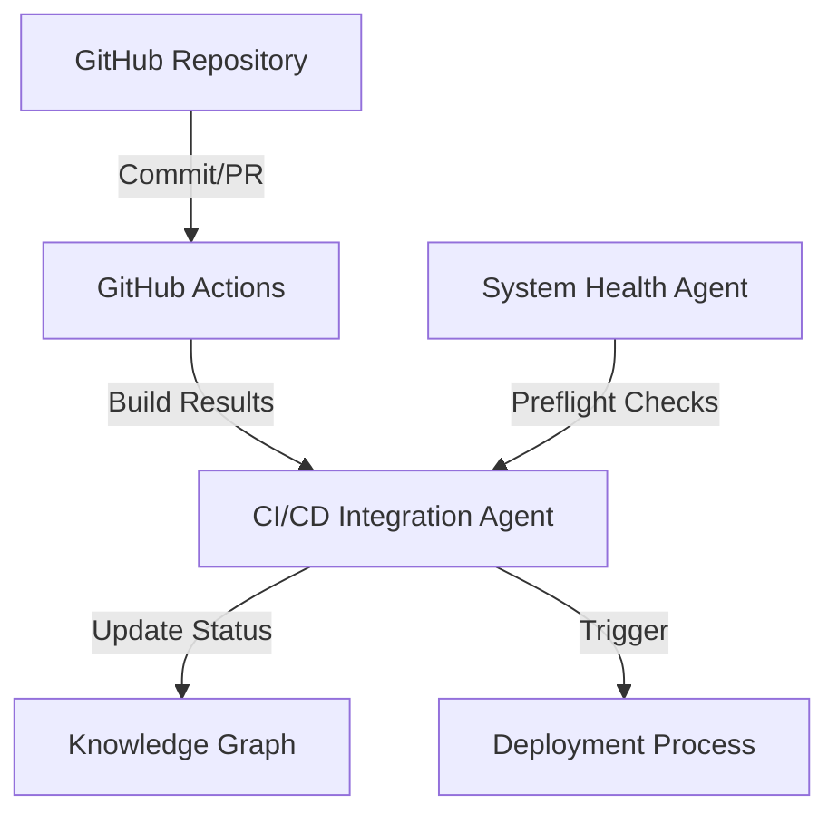

# GitHub Integration with Devloop's Agentic Architecture

## Overview

This document outlines how Devloop's agentic architecture integrates with GitHub to create a seamless development workflow that enhances the modern software development lifecycle (SDLC). By leveraging GitHub's collaborative features alongside Devloop's agent-based automation, teams can achieve greater efficiency, code quality, and traceability throughout the development process.

## Core Integration Principles

1. **Single Source of Truth**: The Devloop Knowledge Graph and GitHub repository work in tandem to provide a complete picture of the project state.
2. **Automation First**: Repetitive Git operations are managed by specialized agents to ensure consistency and reduce manual effort.
3. **Visibility & Traceability**: Every code change is linked to specific features, tasks, and agents in the Knowledge Graph.
4. **Security by Design**: Sensitive information is managed through environment variables and secure secret management, never in code.

## GitHub Integration Architecture

### Repository Structure

Devloop organizes GitHub repositories with a structured approach:

```
repository/
├── .github/                   # GitHub configurations
│   ├── workflows/             # GitHub Actions CI/CD workflows
│   ├── ISSUE_TEMPLATE/        # Standardized issue templates
│   └── PULL_REQUEST_TEMPLATE/ # PR templates linked to feature states
├── agents/                    # Agentic architecture components
├── api/                       # Backend services
├── docs/                      # Documentation (auto-generated and manual)
├── ui/                        # Frontend components
└── scripts/                   # Automation scripts
```

### Agentic GitHub Workflows

#### Repository Agent

The **Repository Agent** manages Git operations such as:

- Branch creation and management based on feature state
- Commit message standardization and validation
- PR creation with auto-populated templates from the Knowledge Graph
- Code ownership assignment based on module expertise



#### CI/CD Integration Agent

The **CI/CD Integration Agent** works with GitHub Actions to:

- Generate workflow files based on project requirements
- Monitor build and test results
- Report status back to the Knowledge Graph
- Trigger deployments based on system health checks



#### Issues and Planning Agent

The **Issues and Planning Agent** synchronizes the Knowledge Graph with GitHub Issues to:

- Create issues based on features in the planning phase
- Update issue statuses based on development progress
- Link commits and PRs to relevant issues
- Generate roadmap visualizations from GitHub milestones and project boards

### Security and Secret Management

Devloop employs a robust security approach for GitHub integration:

1. **Environment Variables**: All sensitive information is stored as environment variables, not in code
2. **Dotenv Pattern**: Using `.env` files (gitignored) with `.env.example` templates
3. **GitHub Secrets**: Integration with GitHub's secret management for CI/CD workflows
4. **Key Rotation**: Automated key rotation managed by the Security Agent
5. **Code Scanning**: Integration with GitHub Advanced Security and CodeQL

## Knowledge Graph Integration

The Devloop Knowledge Graph maintains bidirectional sync with GitHub through:

1. **Commit Hooks**: Updates feature status when commits are pushed
2. **PR Status**: Tracks the review and approval process
3. **Issue Links**: Maintains relationships between issues, features, and code
4. **Repository Metrics**: Collects data on code churn, PR cycle time, and team velocity

## Workflows

### Feature Development Workflow

1. **Planning**: Feature is created in the Knowledge Graph by the Planner Agent
2. **Branch Creation**: Repository Agent creates a feature branch with standardized naming
3. **Development**: Builder Agents generate code and push changes
4. **PR Creation**: Repository Agent creates PR with template populated from feature metadata
5. **CI/CD**: GitHub Actions runs tests and checks, reporting back to the Knowledge Graph
6. **Review**: PR review status is tracked in the Knowledge Graph
7. **Merge**: When approved, changes are merged and the feature status is updated

### System Health Integration

The System Health Agent performs pre-commit and pre-push validation by:

1. Running local health checks before allowing commits
2. Validating structure and dependencies before CI/CD runs
3. Ensuring all environment variables are properly configured
4. Verifying Knowledge Graph consistency with GitHub state

## GitHub Actions Integration

Devloop provides custom GitHub Actions for:

1. **Knowledge Graph Sync**: Maintains KG state with repository changes
2. **Agent Triggering**: Launches agent workflows based on repository events
3. **Documentation Generation**: Auto-generates and publishes documentation from code
4. **Dependency Validation**: Checks for security issues and updates
5. **Environment Verification**: Ensures all required environment variables exist

## Implementation Examples

### Repository Agent Configuration

```json
{
  "agent_id": "repository_agent",
  "github_integration": {
    "repo_url": "https://github.com/vanman2024/devloop.git",
    "branch_prefix_mapping": {
      "feature": "feature/",
      "bugfix": "fix/",
      "module": "module/"
    },
    "commit_message_template": "{{type}}: {{summary}}\n\n{{description}}\n\nFeature: {{feature_id}}",
    "pr_template_path": ".github/PULL_REQUEST_TEMPLATE.md"
  },
  "knowledge_graph_sync": {
    "enabled": true,
    "update_frequency": "realtime",
    "bidirectional": true
  }
}
```

### CI/CD GitHub Action Workflow

```yaml
name: Devloop CI/CD Pipeline

on:
  push:
    branches: [ main, develop, feature/* ]
  pull_request:
    branches: [ main, develop ]

jobs:
  preflight:
    runs-on: ubuntu-latest
    steps:
      - uses: actions/checkout@v3
      - name: Run System Health Check
        uses: vanman2024/devloop-health-action@v1
        with:
          kg_token: ${{ secrets.KNOWLEDGE_GRAPH_TOKEN }}
          
  build:
    needs: preflight
    runs-on: ubuntu-latest
    steps:
      - uses: actions/checkout@v3
      - name: Set up Node.js
        uses: actions/setup-node@v3
        with:
          node-version: 16
      - name: Install dependencies
        run: |
          npm ci
      - name: Build
        run: |
          npm run build
          
  test:
    needs: build
    runs-on: ubuntu-latest
    steps:
      - uses: actions/checkout@v3
      - name: Run tests
        run: |
          npm test
          
  knowledge_graph_sync:
    needs: test
    runs-on: ubuntu-latest
    steps:
      - name: Sync with Knowledge Graph
        uses: vanman2024/devloop-kg-sync@v1
        with:
          kg_token: ${{ secrets.KNOWLEDGE_GRAPH_TOKEN }}
          github_token: ${{ secrets.GITHUB_TOKEN }}
          feature_id: ${{ github.event.pull_request.title }}
```

## Future Enhancements

1. **GitHub App Integration**: A dedicated GitHub App for deeper repository integration
2. **Code Review Agent**: Automated code reviews with insights driven by past issues
3. **Release Notes Generator**: Automatic creation of release notes from Knowledge Graph data
4. **Collaborative Agent PR Reviews**: Multiple specialized agents reviewing different aspects of PRs
5. **Cross-Repo Dependency Management**: Tracking dependencies between multiple Devloop repositories

## Conclusion

By integrating GitHub with Devloop's agentic architecture, teams can experience a more automated, consistent, and traceable development process. The Knowledge Graph acts as the central nervous system, while GitHub provides the collaborative infrastructure and CI/CD capabilities. This integration transforms GitHub from a simple version control system into a key component of an intelligent, self-improving development ecosystem.

The Devloop approach enhances GitHub's capabilities through agent-driven automation, structured knowledge representation, and continuous system validation, resulting in higher quality code delivered more efficiently.