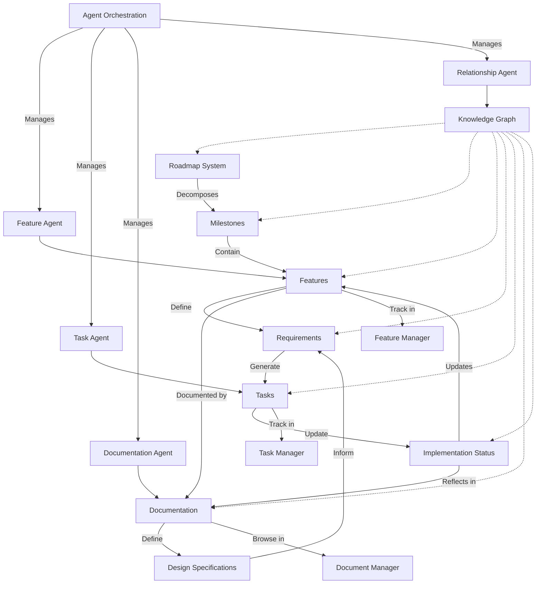
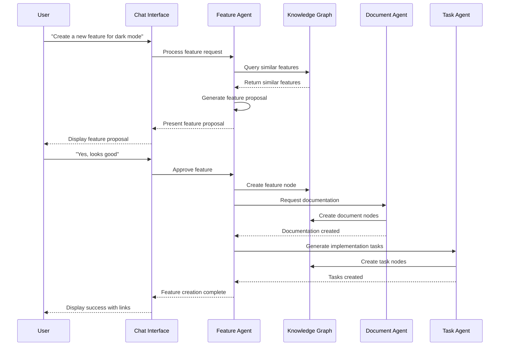
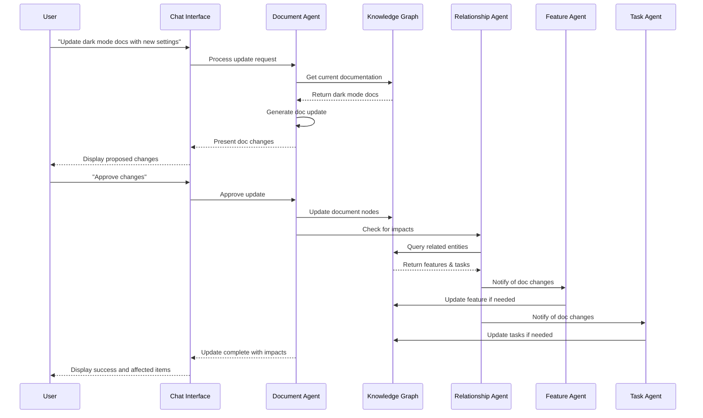

# Unified Roadmap System

This document outlines the architecture for a unified roadmap system that connects features, documentation, tasks, and other project elements in a coherent knowledge graph structure.

## Core Concept

The Unified Roadmap System represents the central nervous system of the DevLoop platform, connecting all aspects of project planning, implementation, and documentation. It's based on these key principles:

1. **Knowledge Graph Foundation**: All entities exist in a connected graph structure
2. **Bidirectional Propagation**: Changes flow in all directions through the graph
3. **Agent-Driven Intelligence**: LLM agents interact with and enhance the system
4. **Single Source of Truth**: All planning flows from a unified roadmap structure
5. **Interactive Exploration**: Users can navigate and modify the roadmap through chat

## System Architecture



## System Components

### 1. Knowledge Graph Core

The foundation of the roadmap system is a knowledge graph database that stores:

- **Nodes**: Entities like features, documents, tasks, milestones
- **Edges**: Relationships between entities
- **Properties**: Metadata for nodes and edges
- **Queries**: Traversal patterns to extract connected information
- **Events**: Triggers for propagating changes through the graph

### 2. Agent Ecosystem

A set of specialized agents that interact with the roadmap:

- **Feature Agent**: Creates and manages features from requirements
- **Task Agent**: Breaks down features into implementable tasks
- **Documentation Agent**: Creates and maintains documentation
- **Relationship Agent**: Discovers and manages connections between entities
- **Orchestration Agent**: Coordinates work between specialized agents

### 3. User Interfaces

Interfaces for interaction with the unified system:

- **Feature Manager**: Create and track features
- **Task Manager**: Manage and track tasks
- **Document Manager**: Browse and edit documentation
- **Roadmap Visualizer**: View and manipulate the overall roadmap
- **Chat Interface**: Interact with agents through natural language

## Entity Relationships

### Feature to Documentation

Features are connected to documentation through bidirectional relationships:

1. **Document Describes Feature**: Documentation explains feature purpose and usage
2. **Feature Implements Document**: Feature implements requirements in documentation
3. **Status Synchronization**: Documentation reflects feature implementation status
4. **Automatic Updates**: Changes in feature propagate to documentation and vice versa

### Feature to Tasks

Features break down into tasks with these relationships:

1. **Feature Generates Tasks**: Tasks are created to implement features
2. **Task Updates Feature**: Task completion updates feature status
3. **Task Dependencies**: Tasks can depend on other tasks, potentially across features
4. **Resource Tracking**: Tasks track resources and time required for feature implementation

### Documentation to Tasks

Documentation and tasks are related through:

1. **Documentation Defines Requirements**: Tasks implement documented requirements
2. **Tasks Update Documentation**: Completed tasks trigger documentation updates
3. **Implementation Verification**: Documentation tests verify task completion
4. **Status Reflection**: Documentation shows which parts are implemented vs. planned

## Workflow Examples

### 1. Creating a New Feature



### 2. Updating Documentation



## Implementation Details

### 1. Knowledge Graph Schema

The central knowledge graph uses this schema:

```javascript
// Node types
const nodeTypes = {
  MILESTONE: 'milestone',
  FEATURE: 'feature',
  TASK: 'task',
  DOCUMENT: 'document',
  DOCUMENT_SECTION: 'document_section',
  REQUIREMENT: 'requirement',
  TEST: 'test'
};

// Edge types
const edgeTypes = {
  CONTAINS: 'contains', // milestone contains features
  IMPLEMENTS: 'implements', // feature implements requirements
  DOCUMENTS: 'documents', // document describes feature
  COMPOSED_OF: 'composed_of', // feature consists of tasks
  DEPENDS_ON: 'depends_on', // entity depends on another entity
  HAS_SECTION: 'has_section', // document has sections
  TESTS: 'tests', // test verifies feature
  RELATED_TO: 'related_to' // generic relationship
};

// Example feature node
const featureNode = {
  id: 'feature-123',
  type: nodeTypes.FEATURE,
  properties: {
    name: 'Dark Mode',
    description: 'Implement dark mode color scheme',
    status: 'in-progress',
    priority: 'high',
    created_at: '2023-04-15T10:30:00Z',
    updated_at: '2023-05-01T14:45:00Z'
  }
};

// Example document node
const documentNode = {
  id: 'doc-456',
  type: nodeTypes.DOCUMENT,
  properties: {
    title: 'Dark Mode Implementation Guide',
    path: '/docs/features/dark-mode-guide.md',
    status: 'draft',
    created_at: '2023-04-16T09:15:00Z',
    updated_at: '2023-04-16T09:15:00Z'
  }
};

// Example edge connecting document to feature
const documentFeatureEdge = {
  id: 'edge-789',
  type: edgeTypes.DOCUMENTS,
  source: 'doc-456',
  target: 'feature-123',
  properties: {
    created_at: '2023-04-16T09:20:00Z'
  }
};
```

### 2. Agent Prompt Templates

Agents use specialized prompt templates for different operations:

```javascript
// Feature creation prompt template
const featureCreationPrompt = `
You are a Feature Creation Agent for the DevLoop system. Your task is to help create a well-defined feature based on the user's requirements.

User Request: "{{user_request}}"

Similar Existing Features:
{{similar_features}}

Based on the user's request and existing features, create a comprehensive feature definition with the following:

1. Feature Name: A clear, concise name
2. Description: 2-3 sentences describing the feature
3. Purpose: Why this feature is needed
4. User Stories: 1-3 user stories in "As a... I want... So that..." format
5. Requirements: 3-5 specific requirements this feature must satisfy
6. Success Criteria: How to determine when this feature is successfully implemented
7. Dependencies: Any other features or components this depends on
8. Suggested Implementation Path: High-level steps to implement this feature

Format your response as a structured feature proposal that a user would understand.
`;

// Document creation prompt template
const documentCreationPrompt = `
You are a Documentation Agent for the DevLoop system. Your task is to create comprehensive documentation for a feature.

Feature: {{feature_json}}

Similar Documents:
{{similar_documents}}

Based on the feature details and similar documents, create a well-structured document with the following:

1. Title: Clear, descriptive title
2. Introduction: What this feature is and its purpose
3. User Guide: How to use the feature (with examples)
4. Configuration: How to configure the feature (if applicable)
5. Technical Details: How the feature works internally (for developers)
6. Related Features: Connections to other system features
7. Implementation Status: Current implementation state
8. Future Plans: Upcoming enhancements (if known)

Format your response as Markdown that could be directly saved as documentation.
`;

// Task generation prompt template
const taskGenerationPrompt = `
You are a Task Agent for the DevLoop system. Your task is to break down a feature into specific implementation tasks.

Feature: {{feature_json}}
Requirements: {{requirements_json}}
Documentation: {{documentation_text}}

Based on the feature details, requirements, and documentation, create a list of specific implementation tasks. For each task, include:

1. Task Name: Clear, action-oriented name
2. Description: What needs to be done
3. Acceptance Criteria: How to know when the task is complete
4. Estimated Complexity: Low, Medium, or High
5. Dependencies: Other tasks that must be completed first
6. Skills Required: Technical skills needed

Create a comprehensive but realistic task breakdown that covers all aspects of implementing this feature.
`;
```

### 3. GraphQL API for Knowledge Graph

The knowledge graph is accessible through a GraphQL API:

```graphql
type Query {
  # Node queries
  node(id: ID!): Node
  nodesByType(type: String!, limit: Int, offset: Int): [Node!]!
  
  # Feature queries
  features(status: String, limit: Int, offset: Int): [Feature!]!
  feature(id: ID!): Feature
  featuresByMilestone(milestoneId: ID!): [Feature!]!
  
  # Document queries
  documents(status: String, limit: Int, offset: Int): [Document!]!
  document(id: ID!): Document
  documentsByFeature(featureId: ID!): [Document!]!
  
  # Task queries
  tasks(status: String, limit: Int, offset: Int): [Task!]!
  task(id: ID!): Task
  tasksByFeature(featureId: ID!): [Task!]!
  
  # Relationship queries
  relationships(sourceId: ID, targetId: ID, type: String): [Relationship!]!
  connectedNodes(nodeId: ID!, relationship: String, direction: String): [Node!]!
  
  # Roadmap queries
  roadmap: Roadmap!
  milestones(status: String): [Milestone!]!
  milestone(id: ID!): Milestone
}

type Mutation {
  # Node mutations
  createNode(input: CreateNodeInput!): Node!
  updateNode(id: ID!, input: UpdateNodeInput!): Node!
  deleteNode(id: ID!): Boolean!
  
  # Relationship mutations
  createRelationship(input: CreateRelationshipInput!): Relationship!
  updateRelationship(id: ID!, input: UpdateRelationshipInput!): Relationship!
  deleteRelationship(id: ID!): Boolean!
  
  # Feature mutations
  createFeature(input: CreateFeatureInput!): Feature!
  updateFeature(id: ID!, input: UpdateFeatureInput!): Feature!
  
  # Document mutations
  createDocument(input: CreateDocumentInput!): Document!
  updateDocument(id: ID!, input: UpdateDocumentInput!): Document!
  
  # Task mutations
  createTask(input: CreateTaskInput!): Task!
  updateTask(id: ID!, input: UpdateTaskInput!): Task!
  
  # Roadmap mutations
  createMilestone(input: CreateMilestoneInput!): Milestone!
  updateMilestone(id: ID!, input: UpdateMilestoneInput!): Milestone!
}

# Node interfaces and types
interface Node {
  id: ID!
  type: String!
  properties: JSONObject!
  createdAt: DateTime!
  updatedAt: DateTime!
}

type Feature implements Node {
  id: ID!
  type: String!
  properties: JSONObject!
  createdAt: DateTime!
  updatedAt: DateTime!
  name: String!
  description: String!
  status: String!
  priority: String!
  milestone: Milestone
  documents: [Document!]!
  tasks: [Task!]!
  dependencies: [Feature!]!
  requirements: [Requirement!]!
}

type Document implements Node {
  id: ID!
  type: String!
  properties: JSONObject!
  createdAt: DateTime!
  updatedAt: DateTime!
  title: String!
  content: String!
  path: String!
  status: String!
  sections: [DocumentSection!]!
  relatedFeatures: [Feature!]!
}

type Task implements Node {
  id: ID!
  type: String!
  properties: JSONObject!
  createdAt: DateTime!
  updatedAt: DateTime!
  name: String!
  description: String!
  status: String!
  assignee: String
  feature: Feature
  dependencies: [Task!]!
}

type Relationship {
  id: ID!
  type: String!
  source: Node!
  target: Node!
  properties: JSONObject!
  createdAt: DateTime!
  updatedAt: DateTime!
}

# Other types...
```

## Roadmap UI Components

The unified roadmap UI provides these views:

1. **Timeline View**: Milestones, features, and tasks on a timeline
2. **Network View**: Graph visualization of relationships
3. **Kanban View**: Features and tasks in workflow stages
4. **Documentation Explorer**: Browsable documentation linked to features
5. **Chat Interface**: Natural language interaction with the system

## Implementation Plan

The unified roadmap system will be implemented in these phases:

### Phase 1: Knowledge Graph Foundation
- Implement graph database schema
- Create basic CRUD operations
- Build initial GraphQL API
- Develop data migration tools

### Phase 2: Agent Integration
- Implement agent orchestration service
- Create specialized agents with initial capabilities
- Build agent communication protocols
- Develop prompt engineering system

### Phase 3: User Interfaces
- Create feature management UI
- Build task management interface
- Develop documentation explorer
- Implement unified chat interface

### Phase 4: Automated Workflows
- Create event propagation system
- Implement bidirectional updates
- Build monitoring and alerting
- Develop audit and history tracking

### Phase 5: Advanced Intelligence
- Implement advanced reasoning
- Create predictive planning capabilities
- Build natural language querying
- Develop automated documentation updates

## Getting Started

To start using the unified roadmap system:

1. **Initialize Knowledge Graph**: Create initial graph structure
2. **Import Existing Data**: Migrate features, docs, and tasks
3. **Setup Agent Environment**: Configure LLM connections
4. **Create Initial Roadmap**: Define milestones and high-level features
5. **Train Users**: Introduce team to the new system

## Conclusion

The unified roadmap system creates a coherent framework that connects all aspects of software development - from initial planning through implementation to documentation. By representing everything in a knowledge graph and using intelligent agents to manage connections, the system ensures all components stay synchronized as they evolve.