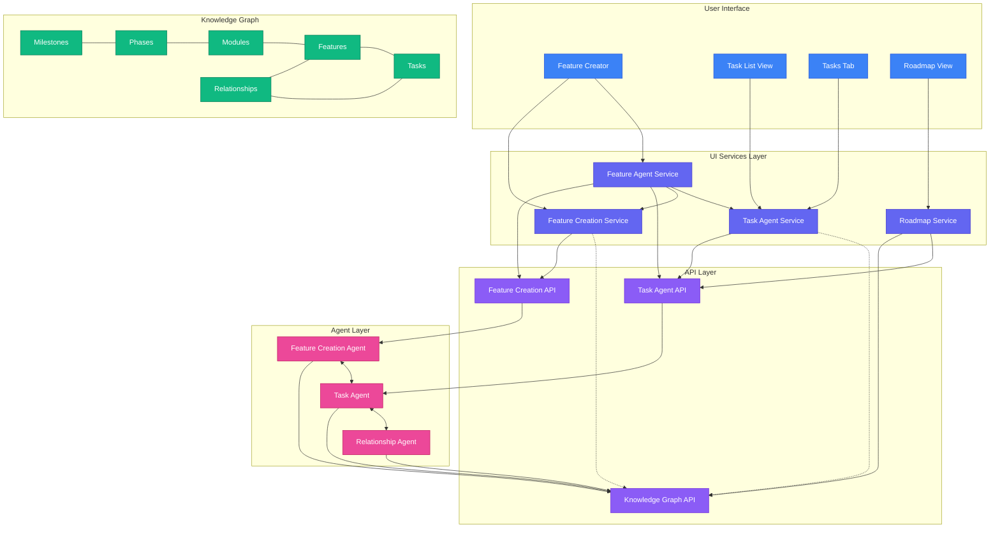
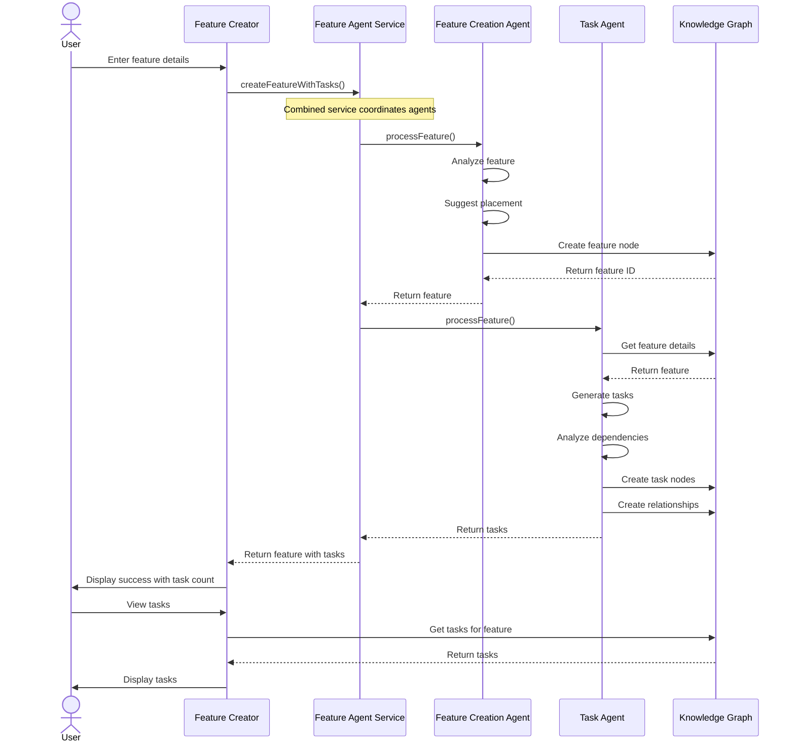
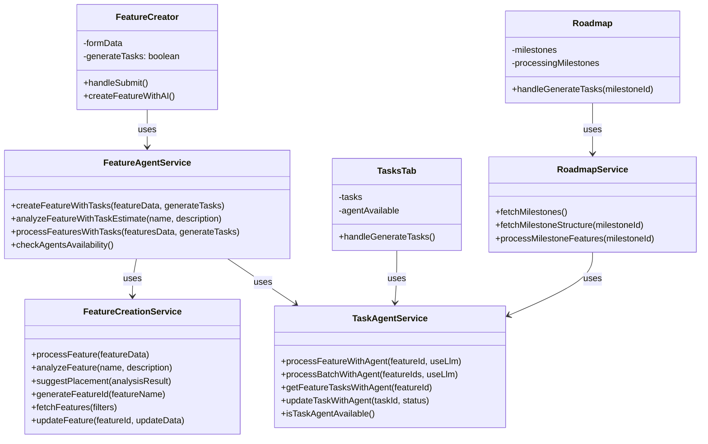

# Agentic Architecture Diagram

The following diagram illustrates the integrated agentic architecture for the DevLoop system, focusing on the Feature Creation Agent and Task Agent integration.

## Flow Diagram

The following diagram illustrates the typical workflow for feature creation and task generation:

## Component Diagram

The following diagram shows the component structure of the Feature Agent Service integration:

These diagrams provide a visual representation of the agentic architecture, showing how the different components interact with each other in the DevLoop system.