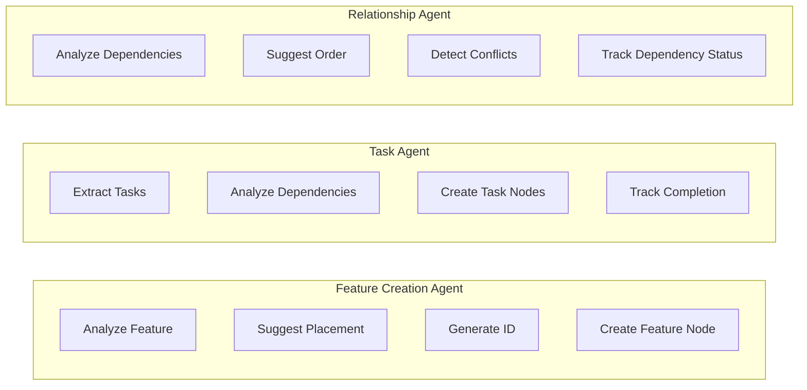
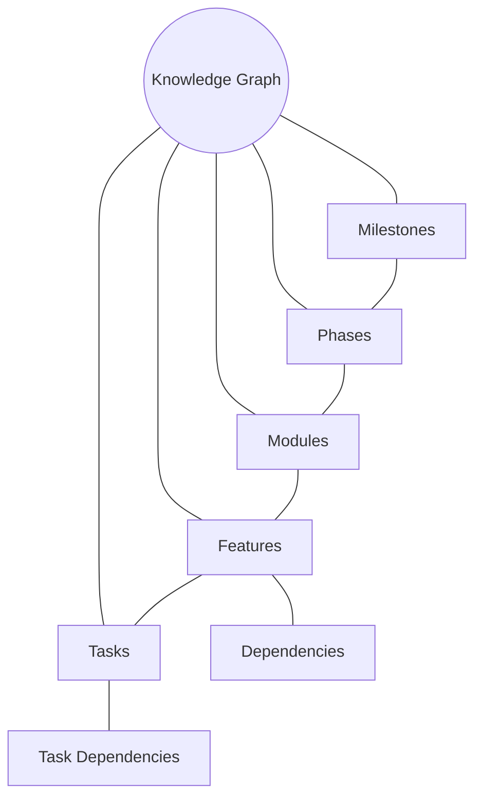
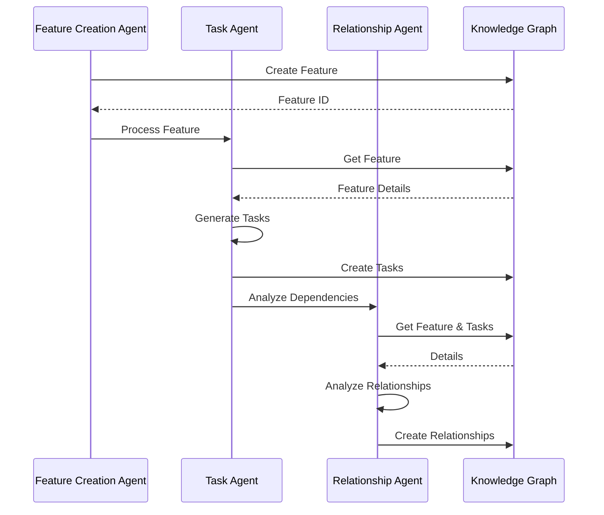
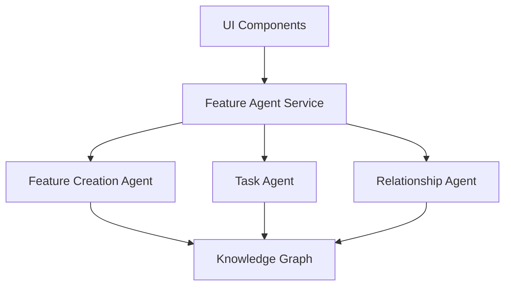
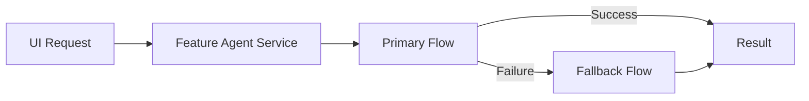
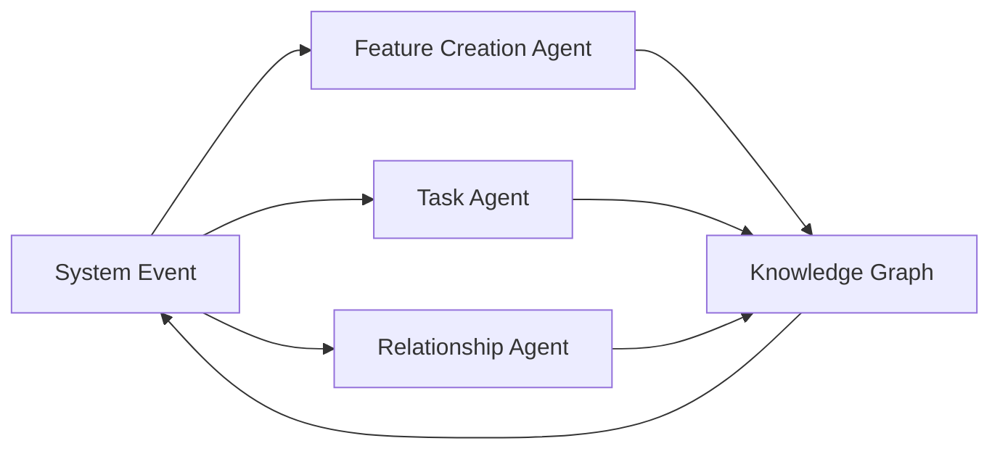
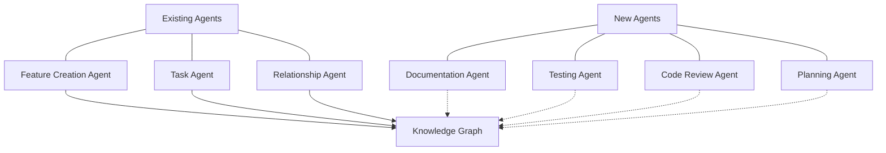
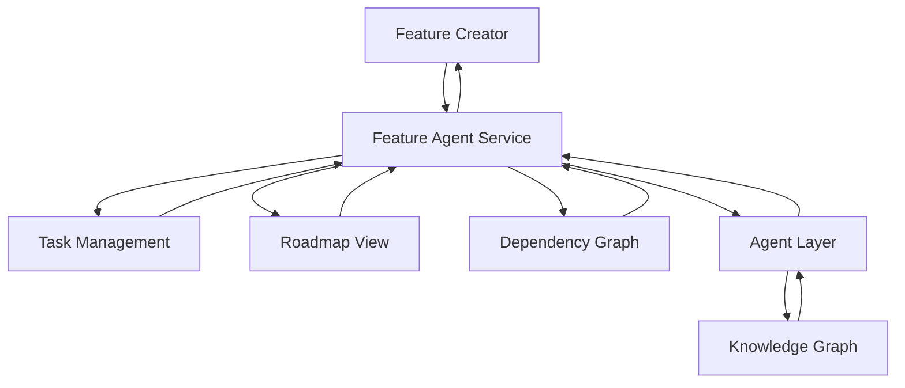
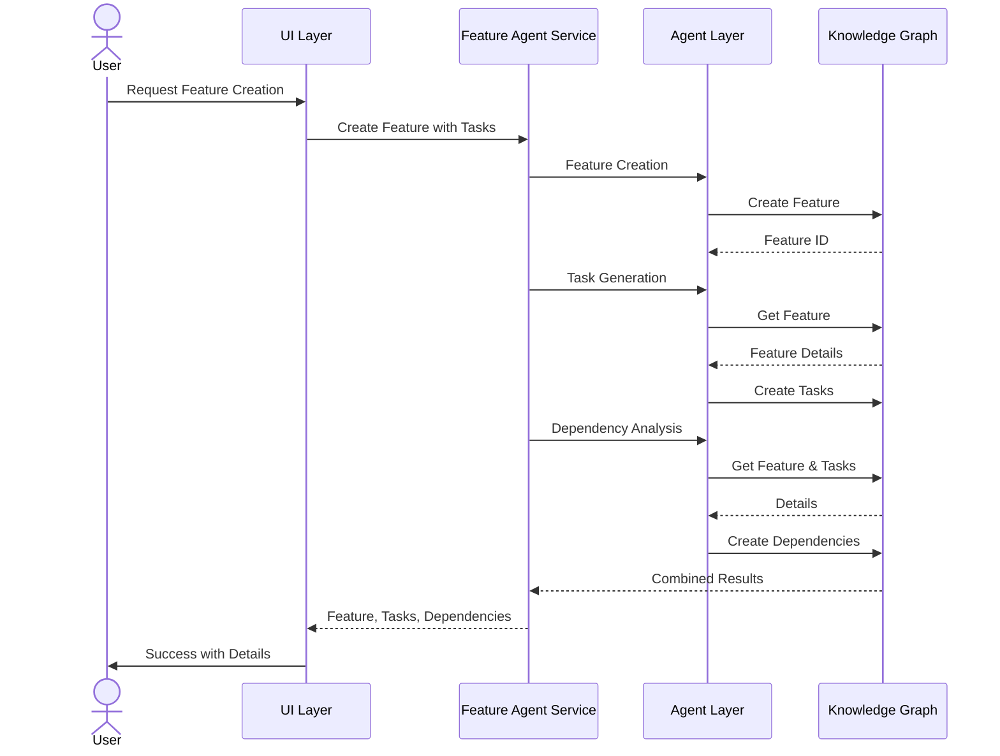
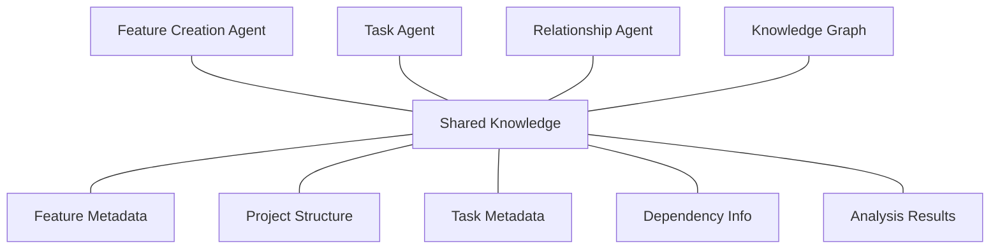

# Agentic Architecture Key Features

This document highlights the key features of the DevLoop agentic architecture, focusing on how the integration of specialized agents creates a powerful system for software development management.

## 1. Specialized Agents with Clear Responsibilities

## 2. Knowledge Graph as Single Source of Truth

## 3. Agent Communication Patterns

## 4. Unified Service Layer for UI Integration

## 5. Fallback Mechanisms for Resilience

## 6. Event-Driven Architecture

## 7. Extensible Design for Adding New Agents

## 8. Integrated UI Components for Agentic Interactions

## 9. Workflow Orchestration Across Agents

## 10. Cross-Agent Knowledge Sharing

These diagrams illustrate the key features of the DevLoop agentic architecture, showing how the different components work together to create a cohesive, extensible system for software development management.