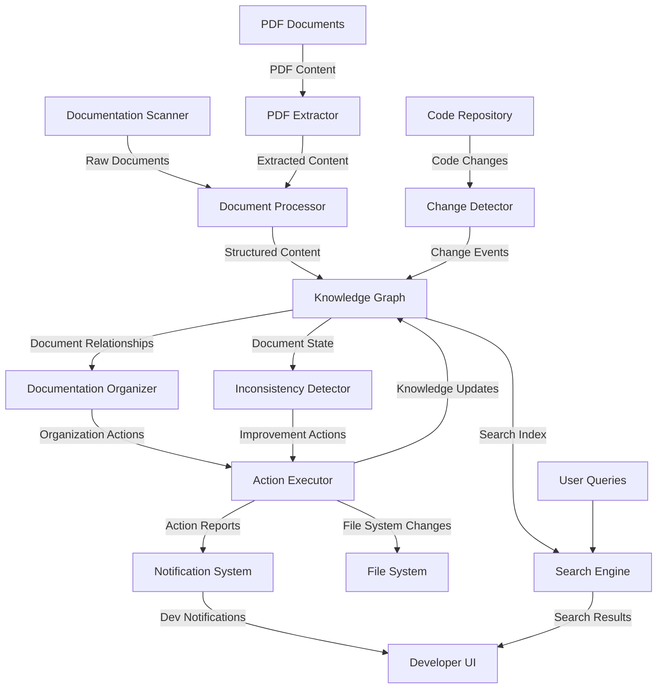

# Dynamic Documentation Management System

## Problem Statement

The DevLoop documentation has grown organically and is becoming unmanageable:
- Documentation spread across multiple directories and formats
- Duplicated information in multiple files
- Outdated documentation not being identified
- No clear organization or hierarchy
- PDF documents disconnected from code docs
- No automated way to maintain coherence

## Solution Architecture

We will implement an agent-based documentation management system that continuously monitors, organizes, and improves our documentation.



## Core Components

### 1. Documentation Scanner & Indexer

```python
# doc_scanner.py
class DocumentScanner:
    def __init__(self, root_dirs, knowledge_base):
        self.root_dirs = root_dirs
        self.knowledge_base = knowledge_base
        self.file_patterns = ["**/*.md", "**/*.txt", "**/*.rst", "**/*.pdf"]
        self.last_scan_hashes = {}  # To track changes
        
    def start_background_scanning(self, interval_minutes=60):
        """Start background scanning thread"""
        self.thread = threading.Thread(target=self._background_scan_loop, 
                                      args=(interval_minutes,))
        self.thread.daemon = True
        self.thread.start()
        
    def _background_scan_loop(self, interval_minutes):
        while True:
            self.scan_all_documentation()
            time.sleep(interval_minutes * 60)
    
    def scan_all_documentation(self):
        """Scan all documentation and identify new/changed files"""
        all_docs = []
        for root_dir in self.root_dirs:
            for pattern in self.file_patterns:
                matching_files = glob.glob(os.path.join(root_dir, pattern), recursive=True)
                for file_path in matching_files:
                    file_hash = self._compute_file_hash(file_path)
                    
                    # Check if file is new or changed
                    if file_path not in self.last_scan_hashes or self.last_scan_hashes[file_path] != file_hash:
                        doc_content = self._extract_content(file_path)
                        all_docs.append({
                            "path": file_path,
                            "content": doc_content,
                            "last_modified": os.path.getmtime(file_path),
                            "size": os.path.getsize(file_path),
                            "hash": file_hash
                        })
                        self.last_scan_hashes[file_path] = file_hash
        
        return all_docs
    
    def _extract_content(self, file_path):
        """Extract content from a file based on its type"""
        if file_path.endswith('.pdf'):
            return pdf_extractor.extract_text(file_path)
        else:
            with open(file_path, 'r', encoding='utf-8') as f:
                return f.read()
    
    def _compute_file_hash(self, file_path):
        """Compute hash of file contents for change detection"""
        hash_md5 = hashlib.md5()
        with open(file_path, "rb") as f:
            for chunk in iter(lambda: f.read(4096), b""):
                hash_md5.update(chunk)
        return hash_md5.hexdigest()
```

### 2. PDF Extractor

```python
# pdf_extractor.py
class PDFExtractor:
    def __init__(self):
        self.extraction_cache = {}  # Cache extracted content
        
    def extract_text(self, pdf_path):
        """Extract text content from PDF"""
        if pdf_path in self.extraction_cache:
            return self.extraction_cache[pdf_path]
            
        try:
            text = ""
            with open(pdf_path, 'rb') as file:
                reader = PyPDF2.PdfReader(file)
                for page_num in range(len(reader.pages)):
                    page = reader.pages[page_num]
                    text += page.extract_text()
                    
            # Process tables and images if needed
            tables = self._extract_tables(pdf_path)
            if tables:
                text += "\n\n## Tables\n\n" + tables
                
            # Cache the extraction
            self.extraction_cache[pdf_path] = text
            return text
            
        except Exception as e:
            logger.error(f"Error extracting text from {pdf_path}: {str(e)}")
            return ""
    
    def _extract_tables(self, pdf_path):
        """Extract tables from PDF using tabula-py"""
        try:
            # Use tabula to extract tables
            tables = tabula.read_pdf(pdf_path, pages='all', multiple_tables=True)
            table_text = ""
            
            for i, table in enumerate(tables):
                table_text += f"### Table {i+1}\n\n"
                table_text += table.to_markdown() + "\n\n"
                
            return table_text
        except:
            return ""
```

### 3. Knowledge Graph Database

```python
# knowledge_graph.py
class DocumentKnowledgeGraph:
    def __init__(self, neo4j_uri, username, password):
        self.driver = GraphDatabase.driver(neo4j_uri, auth=(username, password))
        self._ensure_schema()
        
    def _ensure_schema(self):
        """Ensure database schema exists"""
        with self.driver.session() as session:
            # Create indexes
            session.run("CREATE INDEX IF NOT EXISTS FOR (d:Document) ON (d.path)")
            session.run("CREATE INDEX IF NOT EXISTS FOR (t:Topic) ON (t.name)")
            
    def add_document(self, doc_data):
        """Add document to knowledge graph"""
        with self.driver.session() as session:
            # Create document node
            result = session.run("""
                MERGE (d:Document {path: $path})
                ON CREATE SET 
                    d.created = timestamp(),
                    d.title = $title,
                    d.summary = $summary,
                    d.content_hash = $hash
                ON MATCH SET 
                    d.updated = timestamp(),
                    d.title = $title,
                    d.summary = $summary,
                    d.content_hash = $hash
                RETURN d.path as path, d.created = timestamp() as is_new
            """, {
                'path': doc_data['path'],
                'title': self._extract_title(doc_data['content']),
                'summary': self._generate_summary(doc_data['content']),
                'hash': doc_data['hash']
            })
            
            record = result.single()
            is_new = record["is_new"]
            
            # Extract topics and link to document
            topics = self._extract_topics(doc_data['content'])
            for topic in topics:
                session.run("""
                    MERGE (t:Topic {name: $topic})
                    WITH t
                    MATCH (d:Document {path: $path})
                    MERGE (d)-[:COVERS]->(t)
                """, {'topic': topic, 'path': doc_data['path']})
                
            # Extract code references and link to document
            code_refs = self._extract_code_references(doc_data['content'])
            for code_ref in code_refs:
                session.run("""
                    MERGE (c:CodeEntity {path: $code_path})
                    WITH c
                    MATCH (d:Document {path: $doc_path})
                    MERGE (d)-[:DOCUMENTS]->(c)
                """, {'code_path': code_ref, 'doc_path': doc_data['path']})
            
            return is_new
    
    def find_similar_documents(self, doc_path, similarity_threshold=0.7):
        """Find documents similar to the given one based on topic overlap"""
        with self.driver.session() as session:
            result = session.run("""
                MATCH (d1:Document {path: $path})-[:COVERS]->(t:Topic)<-[:COVERS]-(d2:Document)
                WHERE d1 <> d2
                WITH d2.path AS similar_path, d2.title AS similar_title, 
                     count(t) AS shared_topics
                MATCH (d1:Document {path: $path})-[:COVERS]->(t1:Topic)
                WITH similar_path, similar_title, shared_topics, count(t1) as total_topics1
                MATCH (d2:Document {path: similar_path})-[:COVERS]->(t2:Topic)
                WITH similar_path, similar_title, shared_topics, 
                     total_topics1, count(t2) as total_topics2
                WITH similar_path, similar_title, shared_topics, 
                     total_topics1, total_topics2,
                     (1.0*shared_topics)/(total_topics1 + total_topics2 - shared_topics) AS jaccard
                WHERE jaccard >= $threshold
                RETURN similar_path, similar_title, jaccard
                ORDER BY jaccard DESC
            """, {'path': doc_path, 'threshold': similarity_threshold})
            
            return [record.data() for record in result]
    
    def find_documentation_gaps(self):
        """Find code entities with missing or insufficient documentation"""
        with self.driver.session() as session:
            result = session.run("""
                MATCH (c:CodeEntity)
                OPTIONAL MATCH (d:Document)-[:DOCUMENTS]->(c)
                WITH c, collect(d) as docs
                WHERE size(docs) = 0
                RETURN c.path as code_path, c.type as code_type
            """)
            
            return [record.data() for record in result]
    
    def _extract_title(self, content):
        """Extract title from document content"""
        # Look for first heading
        match = re.search(r'^#\s+(.+)$', content, re.MULTILINE)
        if match:
            return match.group(1).strip()
        # Or first non-empty line
        lines = content.split('\n')
        for line in lines:
            if line.strip():
                return line.strip()[:80]  # Limit to 80 chars
        return "Untitled Document"
    
    def _generate_summary(self, content):
        """Generate a summary of the document content"""
        # Use LLM to generate summary
        prompt = f"Summarize the following document in 1-2 sentences:\n\n{content[:5000]}"
        summary = llm_service.complete(prompt, max_tokens=100)
        return summary
        
    def _extract_topics(self, content):
        """Extract main topics from document content"""
        # Use LLM to extract topics
        prompt = f"Extract 3-7 main topics or keywords from this document:\n\n{content[:5000]}"
        topics_text = llm_service.complete(prompt, max_tokens=100)
        topics = [t.strip() for t in topics_text.split(',')]
        return topics
        
    def _extract_code_references(self, content):
        """Extract code references from document content"""
        # Look for file paths or class/function references
        # Example: src/utils/parser.py or class MyParser
        file_refs = re.findall(r'`([^`]*\.(py|js|ts|jsx|tsx|java|rb|go))`', content)
        class_refs = re.findall(r'class\s+([A-Za-z0-9_]+)', content)
        function_refs = re.findall(r'function\s+([A-Za-z0-9_]+)', content)
        
        # Combine and normalize
        all_refs = [ref[0] for ref in file_refs] + class_refs + function_refs
        return [ref.strip() for ref in all_refs if ref.strip()]
```

### 4. Documentation Organizer

```python
# doc_organizer.py
class DocumentationOrganizer:
    def __init__(self, knowledge_graph, action_executor):
        self.knowledge_graph = knowledge_graph
        self.action_executor = action_executor
        
    def analyze_and_organize(self):
        """Analyze documentation and suggest organizational improvements"""
        actions = []
        
        # Find duplicate/similar documents
        duplicates = self._find_duplicate_documents()
        for dup_group in duplicates:
            actions.append({
                "type": "merge_suggestion",
                "files": [doc["path"] for doc in dup_group],
                "reason": "These documents contain highly similar content",
                "confidence": dup_group[0]["similarity"]
            })
        
        # Find topic clusters needing organization
        topic_clusters = self._find_topic_clusters()
        for cluster in topic_clusters:
            if len(cluster["documents"]) >= 5:  # If cluster has many docs
                actions.append({
                    "type": "directory_suggestion",
                    "topic": cluster["topic"],
                    "files": [doc["path"] for doc in cluster["documents"]],
                    "suggested_dir": f"docs/{cluster['topic'].lower().replace(' ', '_')}",
                    "reason": f"These documents all relate to '{cluster['topic']}'"
                })
        
        # Find orphaned documents
        orphans = self._find_orphaned_documents()
        for orphan in orphans:
            suggested_dir = self._suggest_location(orphan["path"], orphan["content"])
            actions.append({
                "type": "move_suggestion",
                "file": orphan["path"],
                "suggested_path": suggested_dir,
                "reason": "This document is not connected to other documentation"
            })
        
        return actions
    
    def _find_duplicate_documents(self, similarity_threshold=0.8):
        """Find documents with duplicate or highly similar content"""
        # Implementation using knowledge graph similarity queries
        # and text comparison for confirmation
        pass
        
    def _find_topic_clusters(self):
        """Find clusters of documents on the same topics"""
        # Implementation using knowledge graph community detection
        pass
        
    def _find_orphaned_documents(self):
        """Find documents with few or no connections to other documents"""
        # Implementation using knowledge graph isolation queries
        pass
        
    def _suggest_location(self, doc_path, content):
        """Suggest appropriate location for a document"""
        # Use LLM to suggest appropriate location based on content
        prompt = f"Based on this document's content, suggest the most appropriate directory path within a docs/ folder:\n\n{content[:5000]}"
        suggestion = llm_service.complete(prompt, max_tokens=50)
        return suggestion.strip()
```

### 5. Inconsistency Detector

```python
# inconsistency_detector.py
class InconsistencyDetector:
    def __init__(self, knowledge_graph, code_analyzer):
        self.knowledge_graph = knowledge_graph
        self.code_analyzer = code_analyzer
        
    def detect_inconsistencies(self):
        """Detect inconsistencies between documentation and code"""
        issues = []
        
        # Find outdated documentation
        outdated_docs = self._find_outdated_docs()
        for doc in outdated_docs:
            issues.append({
                "type": "outdated_documentation",
                "file": doc["path"],
                "reference": doc["code_ref"],
                "reason": doc["reason"],
                "severity": "high" if doc["confidence"] > 0.8 else "medium"
            })
        
        # Find contradictory documentation
        contradictions = self._find_contradictions()
        for contradiction in contradictions:
            issues.append({
                "type": "contradiction",
                "files": [doc["path"] for doc in contradiction["documents"]],
                "topic": contradiction["topic"],
                "reason": contradiction["details"],
                "severity": "high"
            })
        
        # Find documentation gaps
        gaps = self._find_documentation_gaps()
        for gap in gaps:
            issues.append({
                "type": "documentation_gap",
                "code_entity": gap["code_path"],
                "entity_type": gap["code_type"],
                "reason": "No documentation found for this code entity",
                "severity": "medium",
                "suggested_doc": self._generate_doc_stub(gap["code_path"])
            })
        
        return issues
    
    def _find_outdated_docs(self):
        """Find documentation that's out of sync with code"""
        # Implementation comparing doc content with code analysis
        pass
        
    def _find_contradictions(self):
        """Find contradictions between documentation files"""
        # Implementation using knowledge graph and semantic comparison
        pass
        
    def _find_documentation_gaps(self):
        """Find code without documentation"""
        # Implementation using code analysis and knowledge graph
        return self.knowledge_graph.find_documentation_gaps()
        
    def _generate_doc_stub(self, code_path):
        """Generate documentation stub for code entity"""
        code_content = self.code_analyzer.get_code_content(code_path)
        prompt = f"Generate documentation for this code:\n\n```python\n{code_content}\n```"
        doc_stub = llm_service.complete(prompt, max_tokens=500)
        return doc_stub
```

### 6. Action Executor

```python
# action_executor.py
class ActionExecutor:
    def __init__(self, knowledge_graph, notification_system):
        self.knowledge_graph = knowledge_graph
        self.notification_system = notification_system
        self.pending_actions = []
        self.completed_actions = []
        
    def add_action(self, action):
        """Add action to pending queue"""
        self.pending_actions.append({
            **action,
            "id": str(uuid.uuid4()),
            "created": datetime.datetime.now().isoformat(),
            "status": "pending"
        })
        
    def get_pending_actions(self, action_type=None):
        """Get pending actions, optionally filtered by type"""
        if action_type:
            return [a for a in self.pending_actions if a["type"] == action_type]
        return self.pending_actions
        
    def execute_action(self, action_id, approval_info=None):
        """Execute a specific action"""
        action = next((a for a in self.pending_actions if a["id"] == action_id), None)
        if not action:
            raise ValueError(f"Action {action_id} not found")
            
        if approval_info:
            action["approved_by"] = approval_info["user"]
            action["approval_note"] = approval_info.get("note", "")
            
        try:
            if action["type"] == "merge_suggestion":
                self._execute_merge(action)
            elif action["type"] == "directory_suggestion":
                self._execute_directory_creation(action)
            elif action["type"] == "move_suggestion":
                self._execute_move(action)
            elif action["type"] == "update_outdated":
                self._execute_update(action)
            elif action["type"] == "fix_contradiction":
                self._execute_contradiction_fix(action)
            elif action["type"] == "create_missing_doc":
                self._execute_doc_creation(action)
                
            action["status"] = "completed"
            action["completed"] = datetime.datetime.now().isoformat()
            self.completed_actions.append(action)
            self.pending_actions.remove(action)
            
            # Notify about action execution
            self.notification_system.send_notification({
                "type": "action_executed",
                "action": action
            })
            
            return {"success": True, "action": action}
            
        except Exception as e:
            action["status"] = "failed"
            action["error"] = str(e)
            
            # Notify about action failure
            self.notification_system.send_notification({
                "type": "action_failed",
                "action": action,
                "error": str(e)
            })
            
            return {"success": False, "error": str(e), "action": action}
    
    def _execute_merge(self, action):
        """Merge similar documents"""
        files = action["files"]
        contents = []
        
        # Collect content of all files
        for file_path in files:
            with open(file_path, 'r', encoding='utf-8') as f:
                contents.append(f.read())
                
        # Use LLM to merge the content
        prompt = f"Merge these {len(files)} documents into a single cohesive document, preserving all information without duplication:\n\n"
        for i, content in enumerate(contents):
            prompt += f"DOCUMENT {i+1}:\n{content}\n\n"
            
        merged_content = llm_service.complete(prompt, max_tokens=4000)
        
        # Write merged content to the primary file
        primary_file = min(files, key=lambda f: os.path.getmtime(f))  # Choose oldest file
        with open(primary_file, 'w', encoding='utf-8') as f:
            f.write(merged_content)
            
        # Add notice to other files
        for file_path in files:
            if file_path != primary_file:
                with open(file_path, 'w', encoding='utf-8') as f:
                    f.write(f"# This document has been merged\n\nThe content of this document has been merged into [{os.path.basename(primary_file)}]({os.path.relpath(primary_file, os.path.dirname(file_path))}).\n\nThis file is kept temporarily for reference but will be removed in a future update.")
            
        # Update knowledge graph
        for file_path in files:
            with open(file_path, 'r', encoding='utf-8') as f:
                content = f.read()
                doc_data = {
                    "path": file_path,
                    "content": content,
                    "hash": self._compute_file_hash(file_path)
                }
                self.knowledge_graph.add_document(doc_data)
                
        # Create symbolic links for backwards compatibility
        for file_path in files:
            if file_path != primary_file:
                symlink_path = file_path + ".symlink"
                os.symlink(os.path.abspath(primary_file), symlink_path)
```

### 7. Notification System

```python
# notification_system.py
class NotificationSystem:
    def __init__(self, config):
        self.config = config
        self.notification_handlers = {
            "slack": self._send_slack_notification,
            "email": self._send_email_notification,
            "github": self._create_github_issue,
            "console": self._log_to_console
        }
        
    def send_notification(self, notification_data):
        """Send notification to configured channels"""
        notification_type = notification_data["type"]
        
        # Determine which channels to use based on notification type
        channels = self.config.get("notification_channels", {}).get(notification_type, ["console"])
        
        results = {}
        for channel in channels:
            if channel in self.notification_handlers:
                try:
                    result = self.notification_handlers[channel](notification_data)
                    results[channel] = {"success": True, "result": result}
                except Exception as e:
                    results[channel] = {"success": False, "error": str(e)}
            else:
                results[channel] = {"success": False, "error": f"Unknown channel: {channel}"}
                
        return results
    
    def _send_slack_notification(self, notification_data):
        """Send notification to Slack"""
        # Implementation using Slack API
        pass
        
    def _send_email_notification(self, notification_data):
        """Send notification via email"""
        # Implementation using SMTP
        pass
        
    def _create_github_issue(self, notification_data):
        """Create GitHub issue for notification"""
        # Implementation using GitHub API
        pass
        
    def _log_to_console(self, notification_data):
        """Log notification to console"""
        formatted = self._format_notification(notification_data)
        print(f"[NOTIFICATION] {formatted}")
        return {"logged": True}
        
    def _format_notification(self, notification_data):
        """Format notification data into human-readable message"""
        notification_type = notification_data["type"]
        
        if notification_type == "action_executed":
            action = notification_data["action"]
            return f"Action executed: {action['type']} - {action.get('reason', '')}"
            
        elif notification_type == "action_failed":
            action = notification_data["action"]
            error = notification_data["error"]
            return f"Action failed: {action['type']} - {error}"
            
        elif notification_type == "inconsistency_found":
            issue = notification_data["issue"]
            return f"Documentation issue found: {issue['type']} - {issue['reason']}"
            
        else:
            return json.dumps(notification_data)
```

### 8. User Interface

```python
# doc_management_cli.py
class DocumentationManagementCLI:
    def __init__(self, knowledge_graph, doc_organizer, inconsistency_detector, action_executor):
        self.knowledge_graph = knowledge_graph
        self.doc_organizer = doc_organizer
        self.inconsistency_detector = inconsistency_detector
        self.action_executor = action_executor
        
    def run(self):
        """Run the CLI interface"""
        while True:
            print("\nDocumentation Management System")
            print("-" * 30)
            print("1. Scan documentation")
            print("2. View pending actions")
            print("3. Execute action")
            print("4. Find similar documents")
            print("5. Check for inconsistencies")
            print("6. Generate documentation report")
            print("7. Exit")
            
            choice = input("\nEnter choice (1-7): ")
            
            if choice == "1":
                self._scan_documentation()
            elif choice == "2":
                self._view_pending_actions()
            elif choice == "3":
                self._execute_action()
            elif choice == "4":
                self._find_similar_documents()
            elif choice == "5":
                self._check_inconsistencies()
            elif choice == "6":
                self._generate_report()
            elif choice == "7":
                print("Exiting...")
                break
            else:
                print("Invalid choice. Please try again.")
                
    def _scan_documentation(self):
        """Scan documentation files"""
        print("Scanning documentation...")
        scanner = DocumentScanner(["/mnt/c/Users/angel/devloop"], self.knowledge_graph)
        docs = scanner.scan_all_documentation()
        print(f"Found {len(docs)} documents")
        
        # Process documents
        for doc in docs:
            print(f"Processing {doc['path']}...")
            is_new = self.knowledge_graph.add_document(doc)
            if is_new:
                print(f"  Added new document")
            else:
                print(f"  Updated existing document")
                
        # Analyze and organize
        print("\nAnalyzing organization...")
        actions = self.doc_organizer.analyze_and_organize()
        
        if actions:
            print(f"Found {len(actions)} suggested actions:")
            for i, action in enumerate(actions, 1):
                print(f"{i}. {action['type']}: {action['reason']}")
                self.action_executor.add_action(action)
        else:
            print("No organizational changes suggested")
            
    def _view_pending_actions(self):
        """View pending actions"""
        actions = self.action_executor.get_pending_actions()
        
        if not actions:
            print("No pending actions")
            return
            
        print(f"\nPending Actions ({len(actions)}):")
        for i, action in enumerate(actions, 1):
            print(f"{i}. [{action['type']}] {action.get('reason', '')}")
            if action['type'] == 'merge_suggestion':
                print(f"   Files: {', '.join(action['files'])}")
            elif action['type'] == 'move_suggestion':
                print(f"   Move: {action['file']} → {action['suggested_path']}")
                
    def _execute_action(self):
        """Execute a pending action"""
        actions = self.action_executor.get_pending_actions()
        
        if not actions:
            print("No pending actions")
            return
            
        print("\nSelect action to execute:")
        for i, action in enumerate(actions, 1):
            print(f"{i}. [{action['type']}] {action.get('reason', '')}")
            
        try:
            choice = int(input("\nEnter action number: "))
            if 1 <= choice <= len(actions):
                action = actions[choice-1]
                
                print(f"\nExecuting action: {action['type']}")
                print(f"Reason: {action.get('reason', '')}")
                
                confirm = input("Proceed? (y/n): ")
                if confirm.lower() == 'y':
                    result = self.action_executor.execute_action(
                        action["id"], 
                        {"user": "cli_user"}
                    )
                    
                    if result["success"]:
                        print("Action executed successfully")
                    else:
                        print(f"Action failed: {result['error']}")
                else:
                    print("Action cancelled")
            else:
                print("Invalid selection")
        except ValueError:
            print("Invalid input")
```

## Deployment & Integration

### 1. Setup as a Service

Run the documentation system as a background service:

```bash
# systemd service configuration
[Unit]
Description=DevLoop Documentation Management System
After=network.target

[Service]
Type=simple
User=devloop
WorkingDirectory=/mnt/c/Users/angel/devloop/doc_manager
ExecStart=/usr/bin/python3 /mnt/c/Users/angel/devloop/doc_manager/main.py --daemon
Restart=on-failure
RestartSec=5s

[Install]
WantedBy=multi-user.target
```

### 2. GitHub Integration

Connect with GitHub for automated documentation management:

```python
# github_integration.py
class GitHubIntegration:
    def __init__(self, repo_owner, repo_name, token):
        self.repo_owner = repo_owner
        self.repo_name = repo_name
        self.github = Github(token)
        self.repo = self.github.get_repo(f"{repo_owner}/{repo_name}")
        
    def create_documentation_issue(self, issue_data):
        """Create GitHub issue for documentation problems"""
        title = f"Documentation Issue: {issue_data['type']}"
        
        body = f"## Documentation Issue Detected\n\n"
        body += f"**Type:** {issue_data['type']}\n"
        body += f"**Severity:** {issue_data.get('severity', 'medium')}\n\n"
        body += f"**Reason:** {issue_data['reason']}\n\n"
        
        if issue_data['type'] == 'outdated_documentation':
            body += f"**File:** {issue_data['file']}\n"
            body += f"**Reference:** {issue_data['reference']}\n\n"
            
        elif issue_data['type'] == 'contradiction':
            body += f"**Files:**\n"
            for file in issue_data['files']:
                body += f"- {file}\n"
            body += f"\n**Topic:** {issue_data['topic']}\n\n"
            body += f"**Details:** {issue_data['details']}\n\n"
            
        elif issue_data['type'] == 'documentation_gap':
            body += f"**Code Entity:** {issue_data['code_entity']}\n"
            body += f"**Entity Type:** {issue_data['entity_type']}\n\n"
            body += f"**Suggested Documentation:**\n```markdown\n{issue_data['suggested_doc']}\n```\n\n"
            
        body += f"\n\n---\n*This issue was automatically generated by the Documentation Management System.*"
        
        # Create labels based on issue type and severity
        labels = ["documentation", issue_data['type']]
        if 'severity' in issue_data:
            labels.append(f"severity:{issue_data['severity']}")
            
        # Create the issue
        issue = self.repo.create_issue(
            title=title,
            body=body,
            labels=labels
        )
        
        return issue
        
    def create_documentation_pr(self, pr_data):
        """Create a PR with documentation improvements"""
        # Implementation for creating branches and PRs with doc changes
        pass
```

### 3. CI/CD Integration

Add documentation checks to CI pipeline:

```yaml
# .github/workflows/docs-check.yml
name: Documentation Quality Check

on:
  push:
    branches: [ main, develop ]
    paths:
      - '**/*.md'
      - '**/*.rst'
      - '**/*.txt'
      - 'docs/**'
  pull_request:
    branches: [ main ]
    paths:
      - '**/*.md'
      - '**/*.rst'
      - '**/*.txt'
      - 'docs/**'

jobs:
  doc-check:
    runs-on: ubuntu-latest
    steps:
      - uses: actions/checkout@v2
        with:
          fetch-depth: 0  # Fetch all history to check for changes
          
      - name: Set up Python
        uses: actions/setup-python@v2
        with:
          python-version: '3.9'
          
      - name: Install dependencies
        run: |
          python -m pip install --upgrade pip
          pip install -r doc_manager/requirements.txt
          
      - name: Run documentation checks
        run: |
          python doc_manager/ci_check.py --report
          
      - name: Upload documentation report
        uses: actions/upload-artifact@v2
        with:
          name: doc-report
          path: doc-report.json
```

## User Workflows

### 1. Daily Documentation Maintenance

```
1. System automatically scans all documentation files (scheduled task)
2. Inconsistencies and organization issues are detected
3. Notifications are sent to relevant team members
4. Developers review and approve suggested actions
5. Documentation is automatically reorganized or fixed
```

### 2. On-Demand Documentation Analysis

```
1. Developer runs documentation analysis command
2. System analyzes all documentation and shows issues
3. Developer selects which issues to fix
4. System generates fixes for approval
5. Developer approves and system applies changes
```

### 3. Documentation Addition Workflow

```
1. Developer adds new documentation file
2. System automatically detects, analyzes and indexes it
3. System suggests appropriate location and connections
4. System identifies any duplications or contradictions
5. Developer approves suggestions
6. System organizes documentation appropriately
```

## Implementation Plan

### Phase 1: Core Infrastructure (Week 1-2)
- Set up knowledge graph database
- Implement document scanner and processor
- Create basic CLI interface

### Phase 2: Documentation Analysis (Week 3-4)
- Implement similarity detection
- Add inconsistency detection
- Create action executor

### Phase 3: PDF Integration (Week 5)
- Implement PDF extractor
- Connect PDF content to knowledge graph
- Add PDF-specific organizational rules

### Phase 4: Agent Features (Week 6-7)
- Connect to LLM services
- Implement advanced analysis features
- Create notification system

### Phase 5: UI and Integration (Week 8-10)
- Build web UI for documentation management
- Integrate with GitHub
- Add CI/CD integration