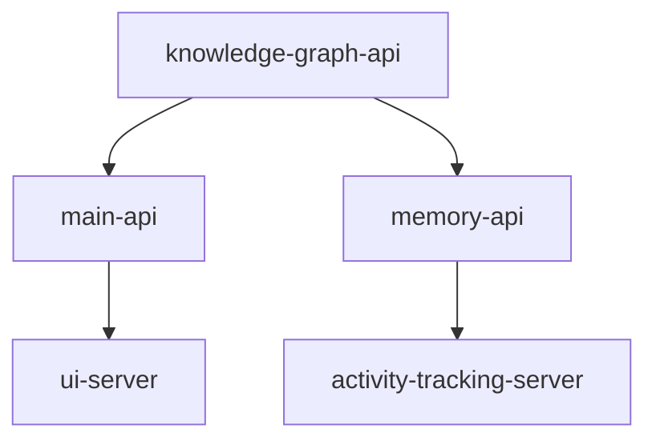

# DevLoop Service Registry
> Generated on: 2025-05-10
> Registry Version: 1.0.0

This document provides an overview of all microservices in the DevLoop system.

## Service Dependencies


## Services

### Main API Server (main-api)
Core application API providing feature management and system functionality

- **URL:** http://localhost:8080
- **Port:** 8080
- **Source:** `/mnt/c/Users/angel/devloop/api`
- **Start Command:** `./launch-api-server.sh`
- **Health Check:** `/api/v1/health`
- **Dependencies:** `knowledge-graph-api`
- **Documentation:** [View Details](/mnt/c/Users/angel/devloop/api/docs/API_DOCUMENTATION.md)
- **Maintainers:** system-team

### UI Server (ui-server)
Frontend application server serving the React UI

- **URL:** http://localhost:3000
- **Port:** 3000
- **Source:** `/mnt/c/Users/angel/devloop/ui`
- **Start Command:** `./start-ui.sh`
- **Health Check:** `/`
- **Dependencies:** `main-api`
- **Documentation:** [View Details](/mnt/c/Users/angel/devloop/ui/docs/README.md)
- **Maintainers:** ui-team

### Document Generation Server (document-server)
AI-powered document generation and analysis service

- **URL:** http://localhost:3002
- **Port:** 3002
- **Source:** `/mnt/c/Users/angel/devloop/ui/server`
- **Start Command:** `./start-document-server.sh`
- **Health Check:** `/api/documents/health`
- **Dependencies:** None
- **Documentation:** [View Details](/mnt/c/Users/angel/devloop/ui/docs/DOCUMENT_MANAGER_README.md)
- **Maintainers:** ai-team, documentation-team

### Knowledge Graph API (knowledge-graph-api)
Knowledge graph storage and query service

- **URL:** http://localhost:8000
- **Port:** 8000
- **Source:** `/mnt/c/Users/angel/devloop/backups/system-core-backup/system-core/memory/manager`
- **Start Command:** `./launch-kg-test-server.sh`
- **Health Check:** `/api/graph/health`
- **Dependencies:** None
- **Documentation:** [View Details](/mnt/c/Users/angel/devloop/backups/system-core-backup/system-core/memory/manager/KNOWLEDGE_GRAPH_API.md)
- **Maintainers:** knowledge-team

### Memory API (memory-api)
System memory and persistence layer API

- **URL:** http://localhost:8001
- **Port:** 8001
- **Source:** `/mnt/c/Users/angel/devloop/backups/system-core-backup/system-core/memory/manager`
- **Start Command:** `./launch-memory-api.sh`
- **Health Check:** `/api/memory/health`
- **Dependencies:** `knowledge-graph-api`
- **Documentation:** [View Details](/mnt/c/Users/angel/devloop/backups/system-core-backup/system-core/memory/manager/README.md)
- **Maintainers:** memory-team

### Activity Tracking Server (activity-tracking-server)
Service for tracking user and system activity

- **URL:** http://localhost:8002
- **Port:** 8002
- **Source:** `/mnt/c/Users/angel/devloop/backups/system-core-backup/system-core/memory/activity`
- **Start Command:** `./launch-activity-server.sh`
- **Health Check:** `/api/activity/health`
- **Dependencies:** `memory-api`
- **Documentation:** Not available
- **Maintainers:** activity-team


## System Information

### Starting All Services
To start all services, run:
```bash
# Start the knowledge graph and memory services first
cd /mnt/c/Users/angel/devloop/backups/system-core-backup/system-core/memory/manager
./launch-kg-test-server.sh

# Start the main API server
cd /mnt/c/Users/angel/devloop
./launch-api-server.sh

# Start the UI and document servers
cd /mnt/c/Users/angel/devloop
./start-ui.sh
```

### Verifying Service Health
To check the health of all services, run:
```bash
# Simple health check script (to be implemented)
./system-core/scripts/check-service-health.sh
```

### Service Ports
The following ports are used by the system:
- 3000: UI Server
- 3002: Document Generation Server
- 8000: Knowledge Graph API
- 8001: Memory API
- 8002: Activity Tracking Server
- 8080: Main API Server
